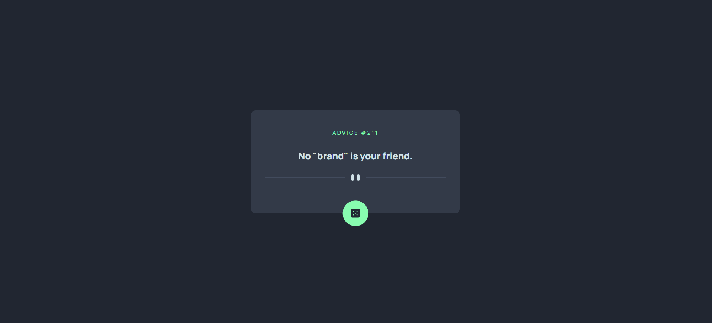

# Frontend Mentor - Advice generator app solution

This is a solution to the [Advice generator app challenge on Frontend Mentor](https://www.frontendmentor.io/challenges/advice-generator-app-QdUG-13db). Frontend Mentor challenges help you improve your coding skills by building realistic projects.

## Table of contents

- [Overview](#overview)
  - [The challenge](#the-challenge)
  - [Screenshot](#screenshot)
  - [Links](#links)
- [My process](#my-process)
  - [Built with](#built-with)
  - [What I learned](#what-i-learned)
- [Author](#author)

## Overview

### The challenge

Users should be able to:

- View the optimal layout for the app depending on their device's screen size
- See hover states for all interactive elements on the page
- Generate a new piece of advice by clicking the dice icon

### Screenshot



### Links

- Live Site URL: [advice-generator](https://advice-generator-app-with-react.netlify.app/)

## My process

### Built with

- Semantic HTML5 markup
- CSS custom properties
- Flexbox
- Mobile-first workflow
- [React](https://reactjs.org/) - JS library
- [Styled Components](https://styled-components.com/) - For styles

### What I learned

Learned how to make an animation triggered by a button click.
Learned that I should use a useCallBack hook when I have a function in my dependency array in the useEffect hook.

```css
.sliding-advice {
  animation: slideIn 0.5s forwards;
}

.sliding-out-advice {
  animation: slideOut 0.5s forwards;
}

@keyframes slideIn {
  from {
    transform: translateX(-100%);
  }
  to {
    transform: translateX(0);
  }
}

@keyframes slideOut {
  from {
    transform: translateX(0);
  }
  to {
    transform: translateX(100%);
  }
}
```

```js
const updateAdvice = useCallback((newAdvice, newAdviceId) => {
  const slidingAdvice = document.querySelector(".sliding-advice");
  slidingAdvice.classList.add("sliding-out-advice");
  setTimeout(() => {
    slidingAdvice.classList.remove("sliding-out-advice");
  }, 500);

  setTimeout(() => {
    setAdviceId(newAdviceId); // Set the new advice ID
    setCurrentAdvice(newAdvice); // Set the new advice
  }, 500);
}, []);
```

## Author

- Frontend Mentor - [@MarnyMarina](https://www.frontendmentor.io/profile/MarnyMarina)
